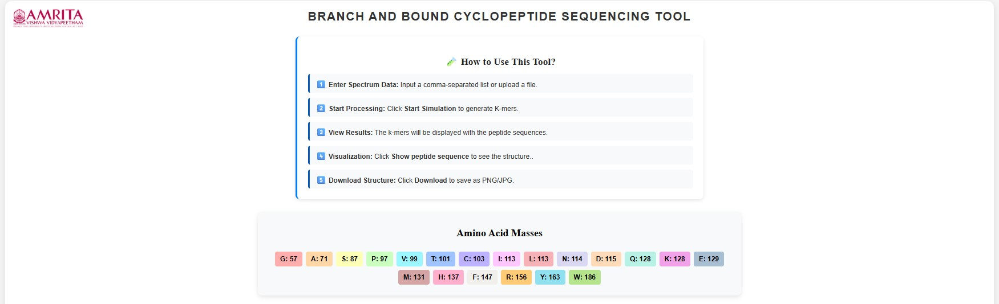
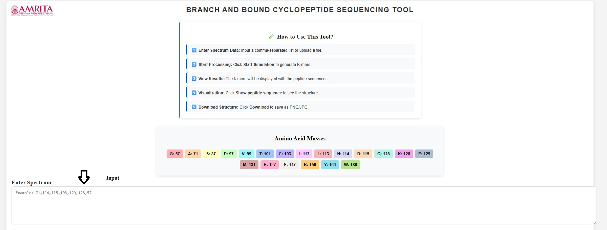
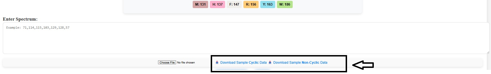
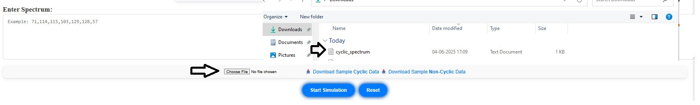
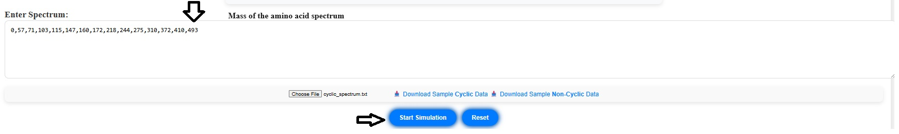
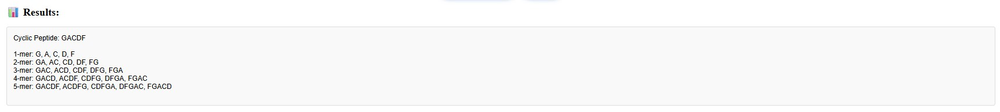
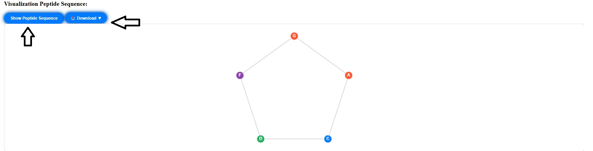

### Procedure

1. Open the simulator window. Read the general instructions on how to use this tool before starting the simulation. The masses for each amino acid were also provided.

&nbsp;
 
2. To start the simulation, enter the spectrum as the input sequence in the box provided. 

&nbsp;
 
3. To practice the simulator, instead of step 2, users can download a sample data provided in the GUI. Here two samples are provided. Sample Cyclic-Data and Sample Non-Cyclic Data. In this procedure, Sample cyclic data is used to work out the experiment. 

&nbsp;
  
4. Click on Choose file button to upload the downloaded sample cyclic data. 

&nbsp;
  
5. The mass of the spectrum of the selected file get displayed as input sequence. Click on start simulation to observe the results.

&nbsp;
 
6. The classification of the amino acids 1 mer to 5-mer are displayed in the result section.

&nbsp;
 
7. Click on Show peptide sequence to observe the sequence. Click on download button to get the results (as a jpg or png) in personal computers.

&nbsp;
   
Similarly, users can download Sample Non-Cyclic Data and follow steps 3 to 7. 
