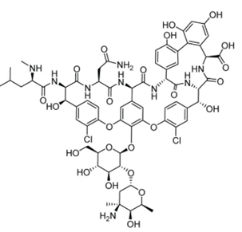

### Introduction

The central dogma of molecular biology depicts that all proteins are originally found in DNA, and the DNA is transcribed into RNA and then translated into proteins by ribosomes. Nonribosomal peptides (NRPs) are proteins that are synthesized by NRP synthetase and do not belong to this central dogma. Most of these NRPs are cyclic in structure and sequencing these structures is challenging. Cyclopeptides differ from linear peptides in that their terminal amino and carboxyl groups are covalently linked, creating a more rigid and stable structure. The only way to sequence NRPs is to fragment them and acquire the fragment’s masses with a mass spectrometer. Given the masses of all possible peptide fragments and the known masses of amino acids, it is theoretically feasible to reconstruct the amino acid sequence of the original protein. These peptides exist naturally in bacteria, fungi, and plants and function in biological processes, including antimicrobial defense, enzyme inhibition, and signalling processes. This stability of their structure enhances their resistance to enzymatic degradation, expanding its applications in the pharmaceuticals for drug development process. 

### Theory

Cyclopeptides belong to a class of peptides that have a cyclic structure where the amino acid chain is closed in a ring and eliminating free N- and C- termini. This structure can be resistant any kind of conformational changes provided with increased stability and less susceptible to enzymatic actions like peptidases and exoproteases. Most cyclopeptide include modified amino acids such as D-amino acids and N-methylated residues. These rigid structures improve their ability to bind with biological targets such as enzymes and receptors and can penetrate cell membranes more efficiently than linear peptides making them valuable for research and pharmaceutical applications. Studies indicated that there are more than 40 cyclic peptide drugs currently available in the industry. Natural cyclopeptides are found bacteria, fungi, plants, and marine organisms and exhibit antimicrobial, immunosuppressive, or cytotoxic properties. Most of the natural cyclopeptides are found to be assembled with 4–10 amino acid. The smallest cyclic peptide produced by fungi has 7 residues and the largest cyclopeptide in bacteria comprises 78 amino acid residues. Romidepsin (FK 228) is a natural cyclic depsipeptide isolated from the Chromobacterium violaceum fermentation broth. Other well-known examples included Vancomycin produced by Amycolatopsis orientalis, a glycopeptide to treat infections produced by gram positive organism such as Methicillin-resistant Staphylococcus aureus, Cyclosporin A , produced by Tolypocladium inflatum,a cyclic undecapeptide that acts as an immunosuppressant that prevents rejection during organ transplant, Borregomycin A produced by Streptomyces spp, a bioactive cyclopeptide that exhibits potential anticancer applications, Cyclotides from Viola and Rubia species, are cyclic peptides with insecticidal, antimicrobial, and cytotoxic properties, Patellamides produced by Cyanobacteria prochloron spp.) are metal-chelating cyclic peptides that exhibits potential biotechnological applications.

Figure 1. Structure of vancomycin, an example of natural cyclopeptide which functions as an antibiotic

&nbsp;

### Cyclopeptide Sequencing Approaches

Sequencing cyclic peptides is still difficult today since cyclic peptides do not have a defined N- or C-terminus. The usual techniques for cyclic peptide sequencing are 2-D nuclear magnetic resonance (NMR) spectroscopy, where highly purified materials in large amounts are required for analysis. This also complicates the use of conventional sequencing techniques such as Edman degradation and standard mass spectrometry (MS). Mass Spectrometry (MS) employs methods such as Electrospray Ionization-Mass Spectrometry (ESI-MS) or Matrix-Assisted Laser Desorption Ionization-Mass Spectrometry (MALDI-MS) for the analysis of proteins and peptides. The lack of free N- and C-termini makes conventional sequencing methods less effective and highlights the need for specialized strategies such as fragmentation techniques, ring-opening strategies, and computational analysis. Tandem Mass Spectrometry (MS/MS) is the widely accepted approach for analysing cyclic peptides in combination with specialized fragmentation techniques to generate sequence-specific fragments. Tandem mass spectrometry (MS/MS) is widely employed in cyclopeptides as it allows the fragmentation of proteins and peptides to determine the amino acid sequence of proteins and peptides, and it allows the identification of post-translational modifications (PTMs) of proteins and peptides. The peptide sequencing works on the mass spectrometer that shatters molecules into pieces and then weighs the resulting fragments. The mass spectrometer measures the mass of a molecule in daltons (Da), where 1 Da is a equal to the mass of a single nuclear particle (i.e., a proton or neutron). 

Consider an example of Tyrocidine B1, represented by VKLFPWFNQY. The total mass is 1322 Da (99 + 128 + 113 + 147 + 97 + 186 + 147 + 114 + 128 + 163 = 1322) (Fig.2)

Figure.2 The integer mass (number of protons and neutrons in the amino acid molecule) of amino acids

The mass spectrometer breaks each molecule of Tyrocidine B1 into two linear fragments and analyses the samples that may contain billions of identical copies of the peptide that are broken down. One copy of Tyrocidine B1 may break into LFP (mass 357) and WFNQYVK (mass 965), whereas another may break into PWFN and QYVKLF. These masses of fragments are then used to sequence the peptide. The collection of all the fragment masses generated by the mass spectrometer is referred to as an experimental spectrum, contains the masses of all possible linear fragments of the peptide, known as subpeptides Consider the cyclic peptide NQEL and its 12 subpeptides: N, Q, E, L, NQ, QE, EL, LN, NQE, QEL, ELN, and LNQ. Assume that subpeptides may occur more than once if an amino acid occurs multiple times in the peptide; for example, ELEL also has 12 subpeptides: E, L, E, L, EL, LE, EL, LE, ELE, LEL, ELE, and LEL. The theoretical spectrum of a cyclic peptide refers to the collection of all the masses of its subpeptides, in addition to the mass 0 and the mass of the entire peptide, with masses ordered from smallest to largest.  Generating the theoretical spectrum of a known peptide is easy but it is necessary to solve the reverse problem of reconstructing an unknown peptide from its experimental spectrum. The theoretical spectrum has a set of all possible fragment masses that can be generated from a given cyclic peptide sequence. 

&nbsp;

### A Branch-and-Bound Algorithm for Cyclopeptide Sequencing

As discussed, the cyclopeptide sequencing involves the reconstruction of the amino acid sequence of a cyclic peptide based on its mass spectrum. A branch-and-bound algorithm is an essential tool in bioinformatics for cyclopeptide sequencing. It efficiently navigates the combinatorial search space by eliminating infeasible solutions and ensures accurate sequencing of peptides obtained from mass spectrometry data. Here, the algorithm includes a branching step to increase the number of candidate (peptide) solutions, followed by a bounding step to remove hopeless candidates. In the branch-and-bound algorithm, the branching step will extend each candidate peptide of length k into 18 peptides of length k + 1, and the bounding step will remove inconsistent peptides from consideration. In a broader sense, the algorithm aims to reconstruct the peptide sequence whose theoretical spectrum matches the given experimental spectrum.

#### Steps Involved:
1.	Initialization: Start with an empty peptide sequence. Define the experimental spectrum obtained from mass spectrometry.

2.	Branching: Iteratively expand the current peptide sequence by appending each possible amino acid mass. Generate new candidate sequences by considering all standard amino acid masses.

3.	Bounding: Calculate the mass of the current candidate peptide. Compare the theoretical spectrum of the candidate peptide with the experimental spectrum. If the candidate's mass exceeds the parent mass (the maximum mass in the experimental spectrum) or its spectrum is inconsistent with the experimental spectrum, prune (discard) this candidate.

4.	Selection: Continue the branching and bounding process until all candidates are evaluated. Select the candidate whose theoretical spectrum exactly matches the experimental spectrum as the correct peptide sequence.

&nbsp;

#### Mathematical Explanation
##### Peptide Spectrum Generation:

The theoretical spectrum of a cyclic peptide includes the masses of all possible subpeptides, considering both linear and cyclic fragments. For a peptide with sequence "NQEL" (Asparagine-Glutamine-Glutamate-Leucine), the cyclic nature allows for subpeptides like "NQE", "QEL", "ELN", and "LNQ". Calculating the masses of these subpeptides and comparing them to the experimental spectrum enables the identification of the correct sequence.

The "mer" indicates the number of amino acid residues in a peptide. For example, a peptide consisting of a single amino acid residue is referred as a 1-mer, 2-mer indicates a dipeptide, a peptide composed of two amino acids, 3-mer (tripeptide) is a peptide chain composed of three amino acids, and so on. 

&nbsp;

#### Applications of the Branch-and-Bound Algorithm for Cyclopeptide Sequencing
•	It can handle larger peptides and complex spectra.

•	In Bioinformatics and Computational Biology, it is used in De Novo Peptide Sequencing using mass spectrometry-based data to identify unknown cyclic peptides.

•	For pharmaceutical purposes and drug discovery processes in sequencing new antimicrobial peptides from bacterial and fungal sources. Also, novel cyclic peptides are sequenced for targeted therapy in cancer treatment.

•	In food science, it helps in sequencing bioactive peptides and helps in sequencing peptides with antioxidant and antimicrobial properties.

•	In environmental science, it helps in identifying peptide-based toxins in for monitoring pollution. 
